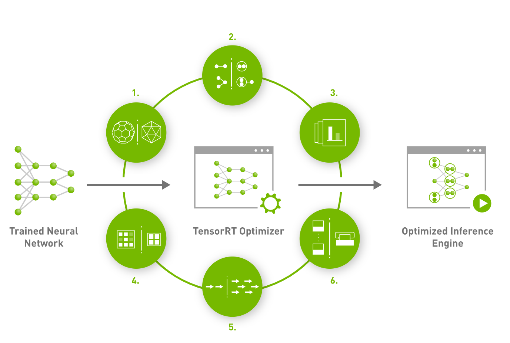

# TensorRT简介

## 简介

TensorRT是可以在NVIDIA各种GPU硬件平台下运行的一个C++推理框架。我们利用Pytorch、TF或者其他框架训练好的模型，可以转化为TensorRT的格式，然后利用TensorRT推理引擎去运行我们这个模型，从而提升这个模型在英伟达GPU上运行的速度。速度提升的比例是比较可观的。
TensorRT是由C++、CUDA、python三种语言编写成的一个库，其中核心代码为C++和CUDA，Python端作为前端与用户交互。当然，TensorRT也是支持C++前端的，如果我们追求高性能，C++前端调用TensorRT是必不可少的。

## 支持平台

TensorRT目前支持计算能力在5.0及以上的显卡（当然也包含了一些嵌入式的显卡），我们常见的RTX30系列计算能力是8.6、RTX20系列是7.5、RTX10系列是6.1，如果我们想要使用TensorRT，首先要确认下我们的显卡是否支持。

## 优化与性能

### 权重与激活精度校准

量化即IN8量化或者FP16以及TF32等不同于常规FP32精度的使用，这些精度可以显著提升模型执行速度并且不会保持原先模型的精度

### 层与张量融合

简单来说就是通过融合一些计算op或者去掉一些多余op来减少数据流通次数以及显存的频繁使用来提速

### 内核自动调整

根据不同的显卡构架、SM数量、内核频率等(例如1080TI和2080TI)，选择不同的优化策略以及计算方式，寻找最合适当前构架的计算方式

### 动态张量显存

我们都知道，显存的开辟和释放是比较耗时的，通过调整一些策略可以减少模型中这些操作的次数，从而可以减少模型运行的时间

### 多流执行

使用CUDA中的stream技术，最大化实现并行操作
