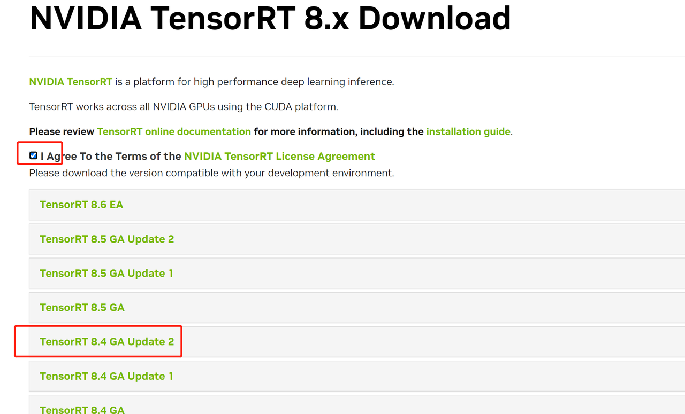

# TensorRT安装

## 介绍
本文档主要介绍有关Tensorrt在ubuntu上的安装，关于Tensorrt的安装可以在conda、docker、终端环境下安装，但是为了防止环境的冲突，本文主要描述的是在docker下的安装步骤。 

本文所采用的安装方式主要参考了链接：https://zhuanlan.zhihu.com/p/446477459 中的半自动安装方法。  

半自动安装是通过拉取官方镜像，然后创建容器，在容器内部安装，后续模型转换等工作也是在容器内部进行，这种方式是最适合大多数人。  

优点：简单方便省心，报错少，对机器上的其它服务不会造成影响，也不会受其它服务限制，主要是 CUDA 和Cudnn版本的限制；   

不足：需要掌握基本的 docker 操作知识，对于新手不是特别友好，但是学习一下上手也很快；     


## 安装
### 从docker hub上下载对应版本的镜像
打开 nvidia 官方的 docker hub镜像库：https://registry.hub.docker.com/r/nvidia/cuda    

根据自己的系统和安装的nvidia的cuda版本选择合适的镜像：     

在终端输入如下命令可以查看服务器所安装的驱动版本    

```
nvidia-smi
```

<div align="center"></div>    

这里我选择的是：   

11.4.0-cudnn8-devel-ubuntu18.04    

拉取镜像的命令：   

```
docker pull nvidia/cuda:11.4.0-cudnn8-devel-ubuntu18.04
```

### 运行镜像/创建容器

```
docker run -it --name trt_test --gpus all -v /home/tensorrt:/tensorrt nvidia/cuda:11.4.0-cudnn8-devel-ubuntu18.04 /bin/bash
```

其中： --name 指定容器的名字  -v 参数为映射的路径    

### 下载TensorRT tar 包

链接：https://developer.nvidia.com/zh-cn/tensorrt    

下载这个 tar 放到容器外的 /home/tensorrt 路径下，它会自动同步到容器内的 /tensorrt 路径下:    

<div align="center"></div>
<div align="center"></div>
<div align="center"></div>
<div align="center"></div>

按照上述的步骤，下载好对应的安装包即可。    

### 回到容器下安装TensorRT

cd到容器内的TensorRT路径下，解压刚刚的压缩包：

```
tar -zxvf  TensorRT-8.4.3.1.Linux.x86_64-gnu.cuda-11.6.cudnn8.2.tar.gz
```

### 安装vim

由于墙内的原因，使用apt安装的时候有时候会出现网络连接的问题，可以使用下面的方式，切换源：    

```
sed -i s@/archive.ubuntu.com/@/mirrors.aliyun.com/@g /etc/apt/sources.list
sed -i s@/security.ubuntu.com/@/mirrors.aliyun.com/@g /etc/apt/sources.list
apt-get clean
apt-get update -y
```

更新完成之后再安装vim  

```
apt-get install vim    
```

### 添加环境变量

将之前解压的TensorRT的路径添加到环境变量中：

在最后一行添加  

```
vim ~/.bashrc
export LD_LIBRARY_PATH=/解压TensorRT的路径/TensorRT-8.2.1.8/lib:$LD_LIBRARY_PATH
source ~/.bashrc
```

###  安装python

由于ubuntu自带的python3版本为3.6版本，后续可能某些环境安装出现问题，为了防止python3的版本过低，本次更新的版本为3.8    

```
apt-get install python3.8 python3-pip python3-dev python3-wheel
cd /usr/local/bin
ln -s /usr/bin/python3.8 python
rm /usr/bin/python3
ln -s /usr/bin/python3.8 /usr/bin/python3
```

执行完上面的所有操作之后，可以看到python3的版本为3.8    

<div align="center"></div>

### pip安装对应的TesnsorRT库

注意，一定要使用pip本地安装tar附带的whl包   

一定要选择与python版本相对应的tensorrt版本  

```
cd /tensorrt/TensorRT-8.4.3.1/python
pip3 install tensorrt-8.4.3.1-cp38-none-linux_x86_64.whl
```

### 验证TensorRT是否安装成功

<div align="center"></div>

如果验证成功，则TensorRT环境安装成功，接下来便可以进行开发了。    